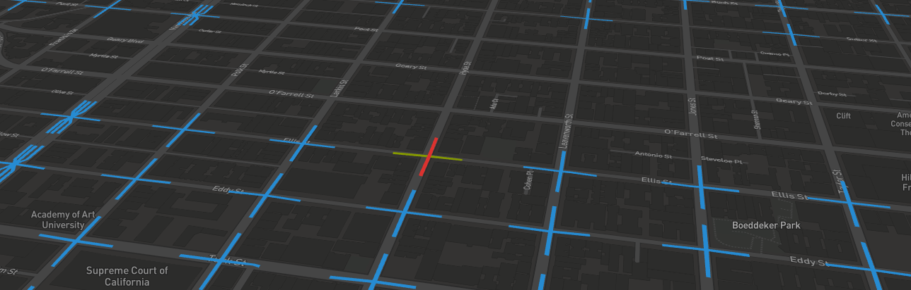

# signals

> A project I will probably never finish since I'm a lazy fuck

    yarn

Visualize realtime looping traffic light state, along with tool to record cycles.

Based on SF open data.

### Brain lag

> The brain lag issue is the name I called the response time between a change
> happening and the actual time for my brain to pick up the information and
> dispatch it to the keypress, creating error increasing over time.

I solved by creating a collection of timestamp samples that are supposed to be green.
That implies going twice to map one signal at another time, preferably another day and
hour to be sure the cycle does not vary on schedule.

## Cool stuff used in there

 - deck.gl
 - webpack
 - react-virtualized
 - react-plam
 - immutablejs (to a certain extent :no_mouth:)
 - turfjs
 - pm2

##### Some other names

- signal(s)
- light(s)
- feu(x)
